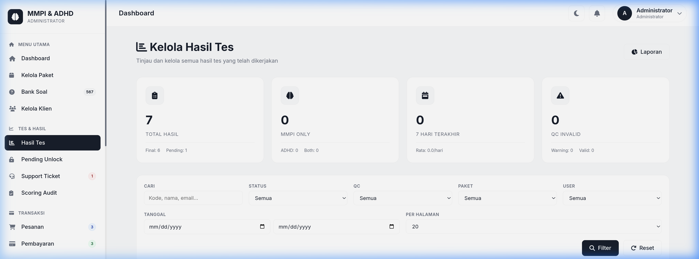
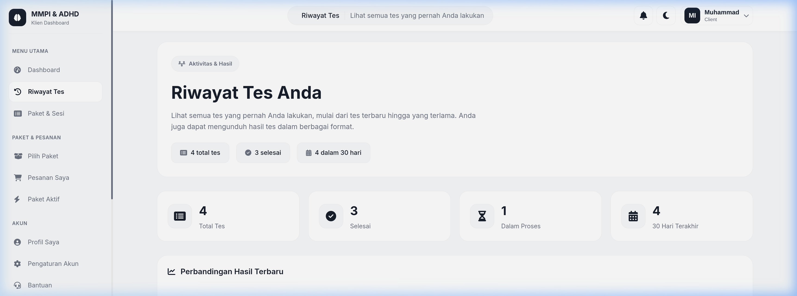
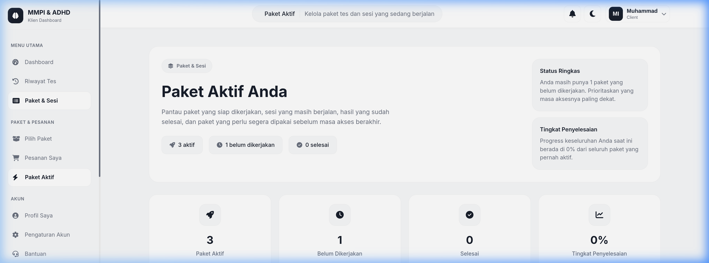

# 🧠 MMPI & ADHD Assessment System

> **Platform Web Psikotes Profesional** untuk penilaian MMPI (Minnesota Multiphasic Personality Inventory) dan ADHD (Attention-Deficit/Hyperactivity Disorder) dengan skoring otomatis dan manajemen klien yang komprehensif.


---

## 🌟 Fitur Utama

### 🛡️ Portal Administrator
*   **Dashboard Statistik**: Ringkasan aktivitas tes, jumlah klien, dan transaksi terbaru.
*   **Manajemen Klien**: Kontrol penuh atas akun pengguna, verifikasi, dan status akses.
*   **Bank Soal & Paket**: Pengelolaan pertanyaan tes dan paket pemeriksaan dengan harga kustom.
*   **Skoring Otomatis & Audit**: Perhitungan hasil tes berdasarkan norma (MMPI-2) dengan log audit transparan.
*   **Verifikasi Pembayaran**: Sistem manajemen pesanan dan pembayaran (Manual & QRIS Support).
*   **Support Ticket**: Penanganan kendala klien melalui sistem tiket internal.

### 👤 Portal Klien (User)
*   **Pengalaman Tes Seamless**: Antarmuka pengerjaan tes yang responsif dan mudah digunakan.
*   **Riwayat & Hasil Instan**: Akses cepat ke riwayat tes dan interpretasi hasil (setelah diverifikasi).
*   **Manajemen Paket**: Pembelian dan pemantauan paket tes aktif secara mandiri.
*   **Profil Personal**: Pengaturan data diri dan foto profil (Avatar) yang mudah diperbarui.

---

## 📸 Dokumentasi Aplikasi

### 💻 Tampilan Administrator

| **Admin Dashboard** | **Manajemen Klien** |
|:---:|:---:|
|  |  |
| **Bank Soal (Questions)** | **Hasil Tes (Results)** |
|  |  |

### 👥 Tampilan Klien

| **Dashboard Klien** | **Pilih Paket Tes** |
|:---:|:---:|
|  |  |
| **Riwayat Tes** | **Paket Aktif** |
|  |  |

---

## 🛠️ Teknologi yang Digunakan

*   **Backend**: PHP (Native) dengan Arsitektur Modular
*   **Database**: MySQL (PDO Extension)
*   **Frontend**: HTML5, CSS3, Bootstrap 5, JavaScript (AJAX/Fetch)
*   **Security**: CSRF Protection, Password Hashing, JWT (API Ready)
*   **Integrasi**: QRIS Payment Support, PDF Generator (mPDF/TCPDF)

---

## 🚀 Panduan Instalasi

1.  **Clone Repository**
    ```bash
    git clone https://github.com/ilhammu29/mmpi-adhd-system.git
    cd mmpi-adhd-system
    ```

2.  **Konfigurasi Database**
    - Buat database baru bernama `mmpi_adhd_db`.
    - Import file `database/schema.sql` ke database tersebut.
    - Jalankan migration file lainnya di `database/` secara berurutan jika diperlukan.

3.  **Pengaturan `includes/config.php`**
    Sesuaikan kredensial database dan domain aplikasi:
    ```php
    define('DB_HOST', 'localhost');
    define('DB_USER', 'your_user');
    define('DB_PASS', 'your_password');
    define('DB_NAME', 'mmpi_adhd_db');
    define('BASE_URL', 'http://localhost/mmpi-adhd-system');
    ```

4.  **Akses Aplikasi**
    - **Client**: `landing_page` atau `login.php`
    - **Admin**: `admin/dashboard.php` (Gunakan akun admin@mmpi.test)

---

## 📄 Lisensi
Proyek ini dikembangkan oleh **Ilham Maulana** (@ilhammu29). Semua hak dilindungi undang-undang.

---

<p align="center">Made with ❤️ for Psychological Assessment Innovation</p>
