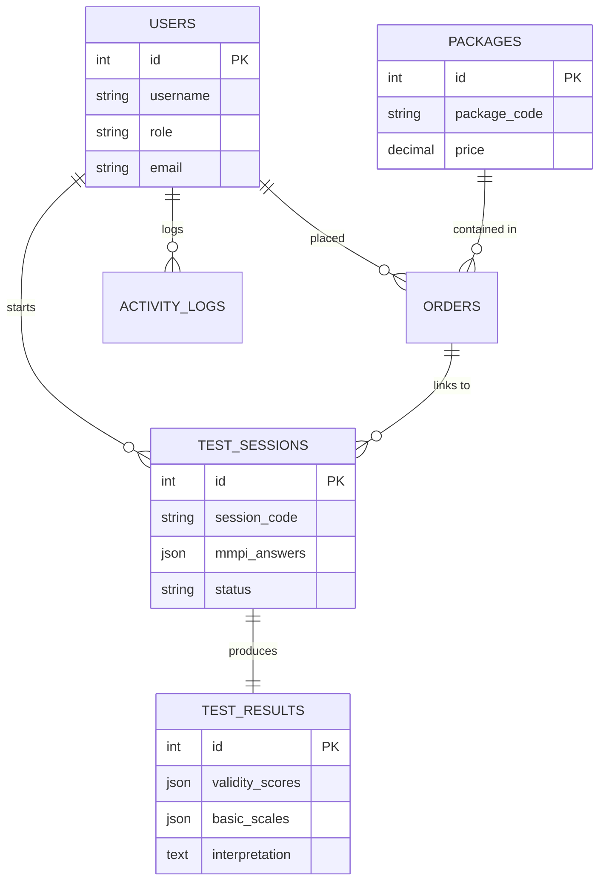
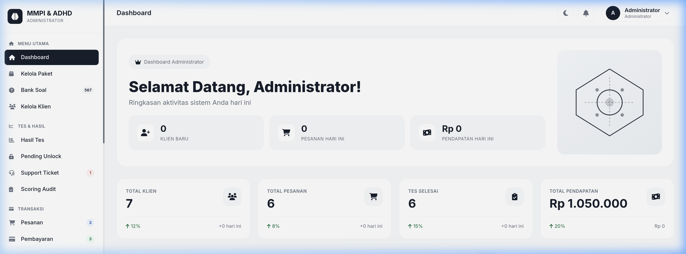
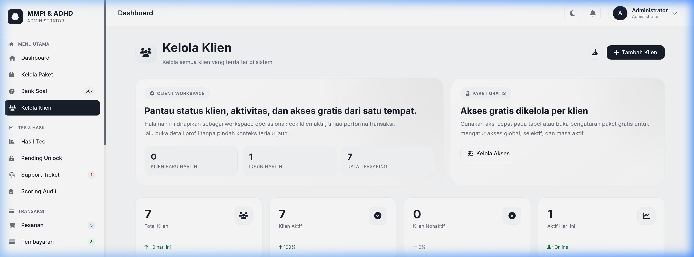
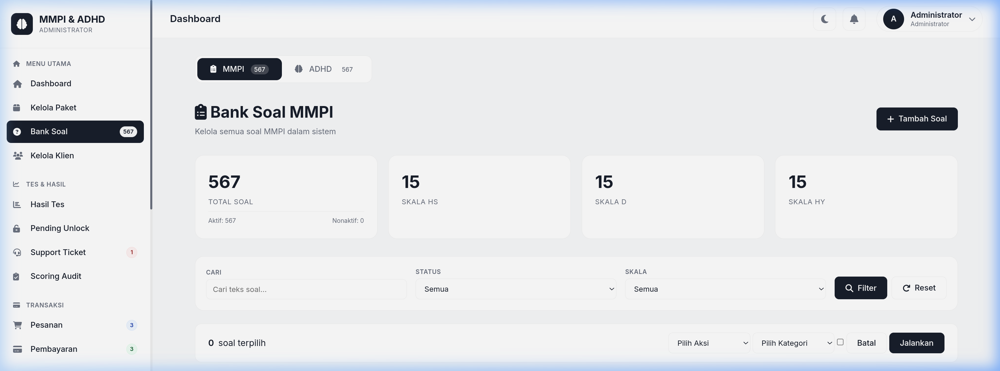
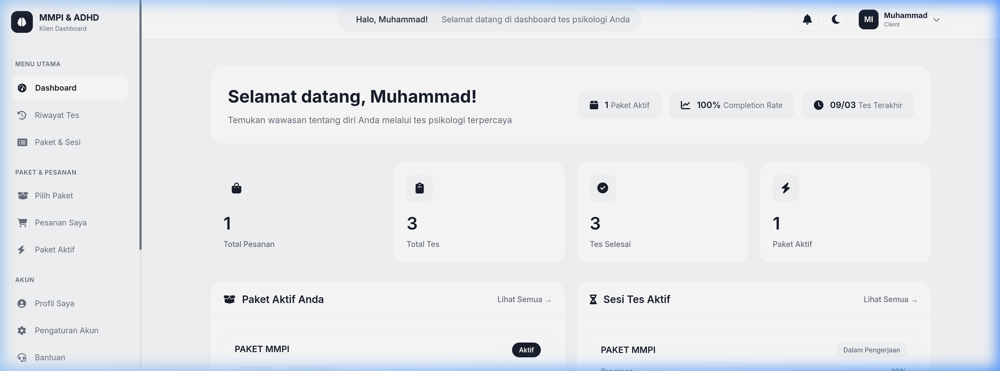
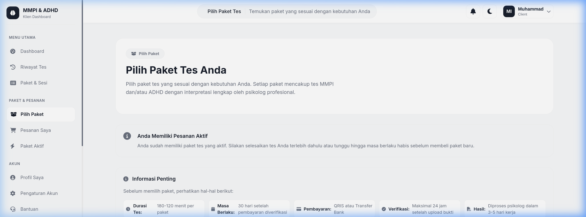

<p align="center">
  
</p>

<h1 align="center">🧠 MMPI & ADHD Online Assessment System</h1>

<p align="center">
  <strong>Solusi Digital Terpadu untuk Pengukuran Psikologis Modern</strong>
</p>

<p align="center">
  
  
  
  
</p>

<p align="center">
  
</p>

---

## 🎬 Demo Animasi

Berikut adalah cuplikan alur penggunaan sistem dari sisi klien:

<p align="center">
  
</p>

---

## 🚀 Gambaran Umum

**Sistem Penilaian MMPI & ADHD** adalah platform web komprehensif yang dirancang untuk membantu psikolog dan lembaga kesehatan dalam mengelola tes kepribadian MMPI (Minnesota Multiphasic Personality Inventory) dan screening ADHD. Sistem ini mengotomatiskan seluruh proses mulai dari registrasi, pembayaran, pengambilan tes, hingga kalkulasi skor berdasarkan norma psikologis yang berlaku.

---

## ✨ Fitur Unggulan

### 🔐 Multi-Role Access Control
- **Administrator**: Memiliki kendali penuh atas sistem, bank soal, manajemen klien, verifikasi pembayaran, dan audit skoring.
- **Client (User)**: Memberikan pengalaman tes yang intuitif, pembelian paket mandiri, dan akses ke hasil tes secara personal.

### 📊 Automated Scoring Engine
- **Skoring MMPI-2**: Perhitungan otomatis untuk Skala Validitas (L, F, K) dan Skala Klinis Dasar (Hs, D, Hy, Pd, Mf, Pa, Pt, Sc, Ma, Si).
- **Normative Data**: Implementasi data norma berdasarkan gender untuk hasil yang akurat.
- **ADHD Screening**: Penilaian otomatis berdasarkan subskala Inattention, Hyperactivity, dan Impulsivity.

### 💳 Management & Integration
- **Payment Gateway**: Dukungan verifikasi manual (Upload Bukti) dan integrasi sistem pembayaran otomatis.
- **Reporting**: Penjanaan laporan hasil tes dalam format PDF yang rapi dan profesional.
- **Support System**: Layanan bantuan melalui sistem tiket internal untuk memudahkan komunikasi admin-klien.

---

## 🏗️ Arsitektur Proyek

Proyek ini dibangun dengan struktur yang modular untuk memudahkan pemeliharaan:

```text
mmpi-adhd-system/
├── admin/            # Portal Administrator
├── client/           # Portal Klien/User
├── api/              # API Endpoint untuk integrasi Frontend
├── includes/         # Konfigurasi, Database Class, & Global Helpers
├── assets/           # Statik Files (CSS, JS, Images, Uploads)
├── database/         # Schema SQL & Migration Files
└── tools/            # Skrip utilitas sistem
```

### 🧬 Skema Database (ERD)



---

## 📸 Galeri Dokumentasi

<details>
<summary><b>🖼️ Klik untuk melihat Screenshot Selengkapnya</b></summary>

### 💻 Dashboard Administrator


### 👥 Manajemen Klien & Bank Soal
| Klien | Bank Soal |
|:---:|:---:|
|  |  |

### 👤 Pengalaman Klien
| Dashboard User | Pilih Paket |
|:---:|:---:|
|  |  |

</details>

---

## 🛠️ Instalasi & Konfigurasi

### Kebutuhan Sistem
- **Server**: Apache/Nginx
- **PHP**: Versi 8.1 ke atas
- **Database**: MySQL 5.7+ / MariaDB 10.4+
- **Extensions**: `PDO`, `openssl`, `mbstring`, `json`, `curl`

### Langkah-langkah
1. **Prepare Database**: Import `database/schema.sql` ke MySQL Anda.
2. **Config File**: Edit `includes/config.php` dan sesuaikan kredensial berikut:
   ```php
   define('DB_HOST', 'localhost');
   define('DB_USER', 'root');
   define('DB_PASS', '');
   define('DB_NAME', 'mmpi_adhd_db');
   define('BASE_URL', 'http://your-domain.com');
   ```
3. **Permissions**: Pastikan folder `assets/uploads/` memiliki izin tulis (writable).

---

## 👨‍💻 Kontribusi
Proyek ini dikembangkan secara eksklusif. Untuk pertanyaan lebih lanjut, hubungi pengembang utama di:
- **GitHub**: [@ilhammu29](https://github.com/ilhammu29)

---

<p align="center">
  <i>Developed with ❤️ for Psychology Professionals.</i>
</p>
